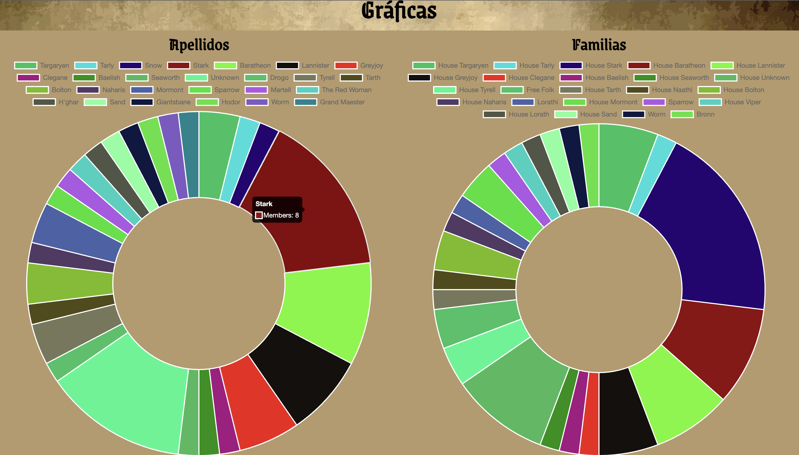

# Data Lovers
***

### Definición del producto

En este proyecto trabajamos una página dirigida a fans de Game of Thrones, donde pudieran visualizar a los personajes 
de la serie y filtrarlos por diferentes categorías así como ordenarlos alfabéticamente.

#### Prototipo de baja fidelidad

#### Prototipo de alta fidelidad

Después de iterar sobre este prototipo comenzamos a diseñar en figma. Primero hicimos un diagrama de flujo simulando 
el flujo que haría un usuario.

Despúes diseñamos la vista para las tarjetas: 

Y la vista de la homepage: 

### Historias de usuario

Con base en los resultados de la encuesta realizada, redactamos las siguientes historias de usuario:

### Pruebas unitarias

## Hacker edition

* 100% Coverage

### Tests de usabilidad
Durante las demos, se nos indicó que los botones de la barra de filtrado se perdían con el fondo de la barra, ahí fue que 
nos recomendaron cambiarles el color y decidimos hacer eso y darles una sombra para que sobresalieran.

### Responsive

